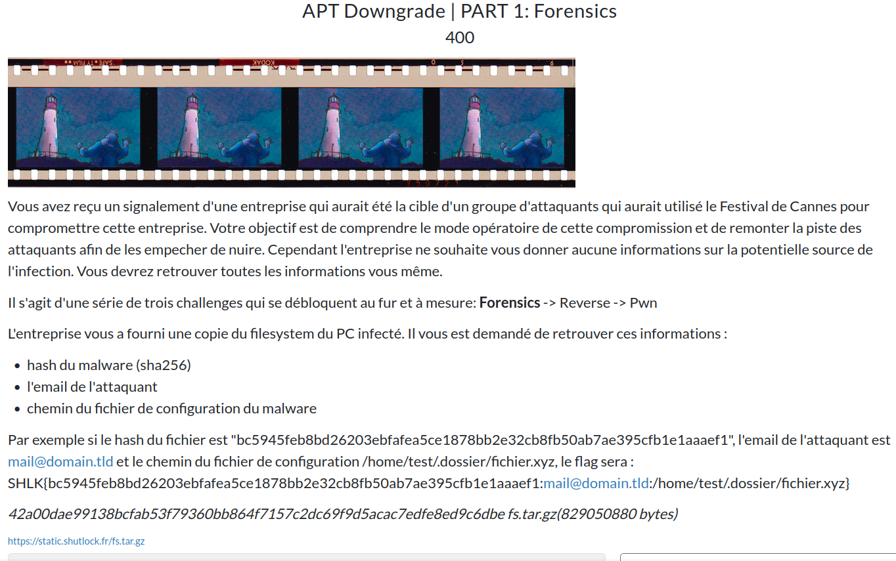

# APT Downgrade



## Prérequis

[fs.tar.gz](https://mega.nz/file/4B4zybKY#0FKWwoJxcTtoP-fOV67EkIQH5hi81VK_i_SnhqS_IaE)

(Optionnel, recommandé) Vérifier les sommes de contrôle.
```bash
sha256sum -c SHA256SUMS.txt
```

<h2>Solution</h2>

<details>
<summary></summary>

* On est en présence de l'ensemble des fichiers d'un système Linux. On commence par explorer globalement.
* Les dossiers `root`, `opt` et `mnt` sont vides. C'est déjà ça de moins à explorer !
* On se tourne vers le dossier `tmp` qui peut être intéressant dans notre cas.
* On y trouve un fichier binaire `._`, peu commun comme nom ! En l'ouvrant dans IDA, il semble que le contenu est obfusqué, on a donc trouvé notre malware.
    ```bash
    sha256sum ./tmp/._
    66640c14f898c78a99757ab4460c635476dfeb9b3b65e8a57fb29202eefb9423	._
    ```
    *Remarque : on aurait pu le trouver avec la commande suivante*
    ```bash
    cd /tmp
    find . -type f ! -size 0 -exec grep -IL . "{}" \;
    ```
* Cherchons désormais le mail de l'attaquant. On construit cette commande bien trop longue :
    ```bash
    grep --binary-files=without-match -rEoh "[a-zA-Z0-9._%+-]+@[a-zA-Z0-9.-]+\.[a-zA-Z]{2,}" ./home | sort -u | less
    ```
    Explications :
    - `--binary-files=without-match` : ignore les fichiers binaires
    - `-r` : recherche récursive
    - `-Eo` : utilise les expressions régulières étendues et affiche uniquement les correspondances
    - `[a-zA-Z0-9._%+-]+@[a-zA-Z0-9.-]+\.[a-zA-Z]{2,}` : expression régulière pour trouver les adresses e-mail
    - `-h` : n'affiche pas le nom du fichier dans les résultats
    - `sort -u` : trie les résultats et supprime les doublons
    - `less` : permet de parcourir les résultats et faire des recherches
* On peut ensuite ré-exécuter la commande sans l'option `-h` pour afficher le nom du fichier dans les résultats.
* Un résultat attire notre attention :`star_wars_official@proton.me`
  * Il provient du fichier `./home/cesar/.thunderbird/48zmwn7v.default-release/ImapMail/mail.shutlock.fr/INBOX`
  * C'est un bon candidat !
* Enfin, on cherche un fichier de configuration, dans le dossier `tmp` :
    ```bash
    find ./tmp/ -name 'config*'
    ```
    On tombe sur `/tmp/config.bin`

Flag : `SHLK{66640c14f898c78a99757ab4460c635476dfeb9b3b65e8a57fb29202eefb9423:star_wars_official@proton.me:/tmp/config.bin}`

</details>