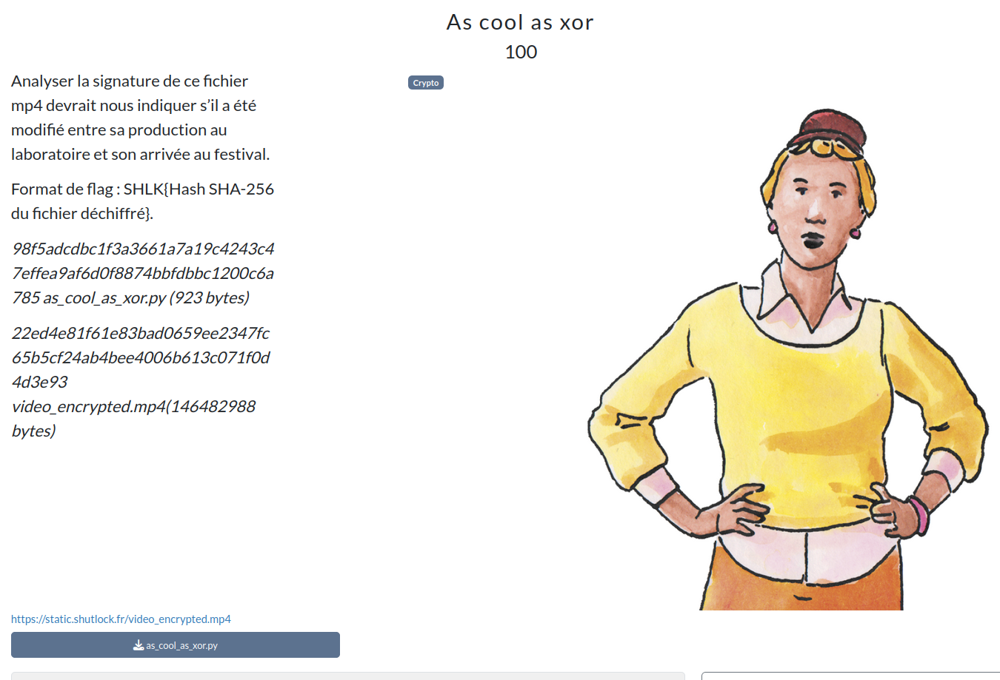

# As cool as xor



## Prérequis

[video_encrypted.mp4](https://mega.nz/file/QdhW1Rwb#mvIVcoZISCEsZzyOXXXPseTDQEZOT2PG6BYDsjqTVms)

(Optionnel, recommandé) Vérifier les sommes de contrôle.
```bash
sha256sum -c SHA256SUMS.txt
```

<h2>Solution</h2>

<details>
<summary></summary>

* On est face à un programme qui utilise un algorithme de type [Feistel](https://fr.wikipedia.org/wiki/R%C3%A9seau_de_Feistel) pour chiffrer une vidéo.
* On nous donne le fichier chiffré, l'algorithme de chiffrement, et l'en-tête du fichier en clair.
* On récupère la clé de chiffrement en exploitant les propriété du chiffrement de Feistel et du XOR, comme il n'y a qu'un tour !
* Le flag est le SHA256 du fichier en clair.

Flag : `SHLK{821db7160a76db43d0e7f73d5361939f6c9ee8c95359d8e074473c5353cc1965}`

</details>