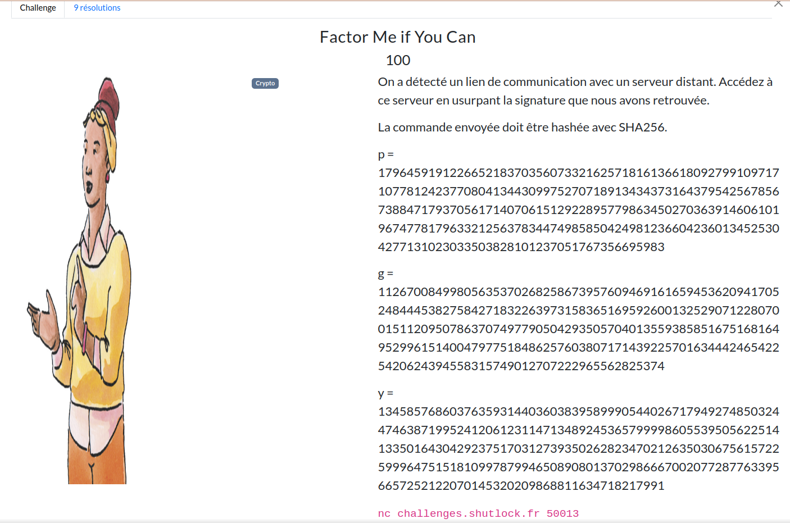

# Factor Me if You Can



```
p = 179645919122665218370356073321625718161366180927991097171077812423770804134430997527071891343437316437954256785673884717937056171407061512922895779863450270363914606101967477817963321256378344749858504249812366042360134525304277131023033503828101237051767356695983

g = 112670084998056353702682586739576094691616594536209417052484445382758427183226397315836516959260013252907122807001511209507863707497790504293505704013559385851675168164952996151400479775184862576038071714392257016344424654225420624394558315749012707222965562825374

y = 134585768603763593144036038395899905440267179492748503244746387199524120612311471348924536579999860553950562251413350164304292375170312739350262823470212635030675615722599964751518109978799465089080137029866670020772877633956657252122070145320209868811634718217991
```

<h2>Solution</h2>

<details>
<summary></summary>

* On est face à un algorithme de signature, où l'on nous donne 3 nombres : $p$, $g$ et $y$.
* Un algorithme particulier utilise cette conventions de nommage : ElGamal.
* On doit donc retrouver la clé secrète $x$ à partir de la clé publique $y$ et des paramètres $p$ et $g$.
* Sauf qu'il s'agit de résoudre le problème du logarithme discret (PDL), qui est un problème difficile en cryptographie, surtout avec des grandes valeurs, ce qui est le cas ici.
* Mais quelques vulnérabilités existent, par exemple si $p-1$ est un produit de petits nombres premiers, on peut utiliser [l'algorithme de Pohlig-Hellman](https://fr.wikipedia.org/wiki/Algorithme_de_Pohlig-Hellman) pour résoudre le PDL.
* On vérifie cette propriété avec `test_factors.py`, puis on résout le PDL grâce à sagemath (`break.sage`), qui implémente déjà l'algorithme de Pohlig-Hellman.
* Une fois $x$ trouvé, on peut signer les 3 commandes que propose le serveur (`solve.py`) :
    ```
    nc challenges.shutlock.fr 50013

    Voici les différentes commandes autorisées:
    - aide : renvoie les différentes commandes autorisées
    - heure : renvoie l'heure actuelle
    - mission : renvoie l'intitulé de mission
    Quel est votre message signé ?
    ```
* [Implémentation de la signature](https://en.wikipedia.org/wiki/ElGamal_signature_scheme)
* On obtient le flag en envoyant la signature de la commande `mission`. 
    ```
    nc challenges.shutlock.fr 50013

    Voici les différentes commandes autorisées:
    - aide : renvoie les différentes commandes autorisées
    - heure : renvoie l'heure actuelle
    - mission : renvoie l'intitulé de mission
    Quel est votre message signé ?

    17[...]533,185[...]682

    Objet : Opération SHLK{wH3r3-LiNe}
    Date : 01/05/2025
    Classification : STRICTEMENT CONFIDENTIEL

    Une personne haut placée au sein de nos rangs a disparu sans laisser de trace. La dernière localisation confirmée remonte aux Jeux Olympiques 2024, où elle a été vue en compagnie d’Otto. Selon les renseignements disponibles, leur rencontre s’est déroulée sans incident apparent et ils se seraient quittés en bons termes.

    Depuis, aucun contact n’a pu être établi malgré nos tentatives répétées. Cependant, selon nos informations les plus récentes, cette personne se trouverait actuellement en France. Compte tenu de la sensibilité des informations qu’elle détient, nous considérons cette disparition comme critique.

    Nous vous transmettrons des informations complémentaires lors de notre prochain regroupement. Préparez vos équipes, vérifiez vos accès, et soyez prêts à déclencher les opérations dès le signal.

    Vive le Listenbourg !
    ```

Flag : `SHLK{wH3r3-LiNe}`

</details>