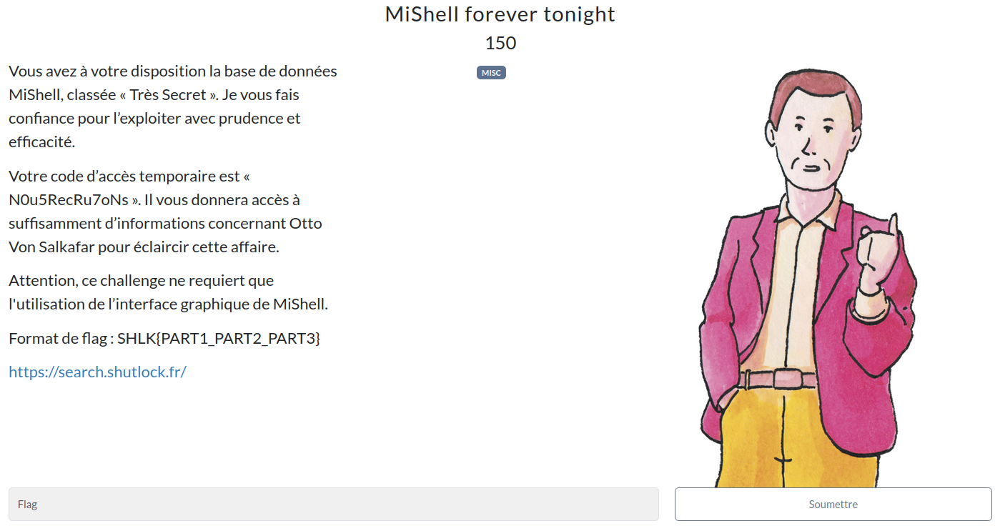
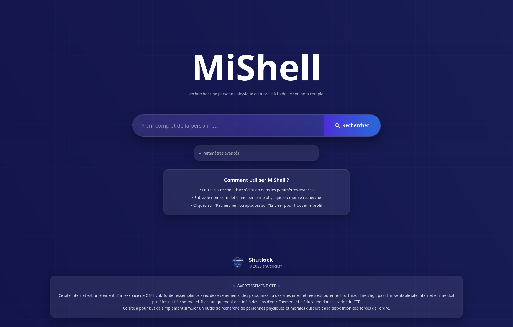
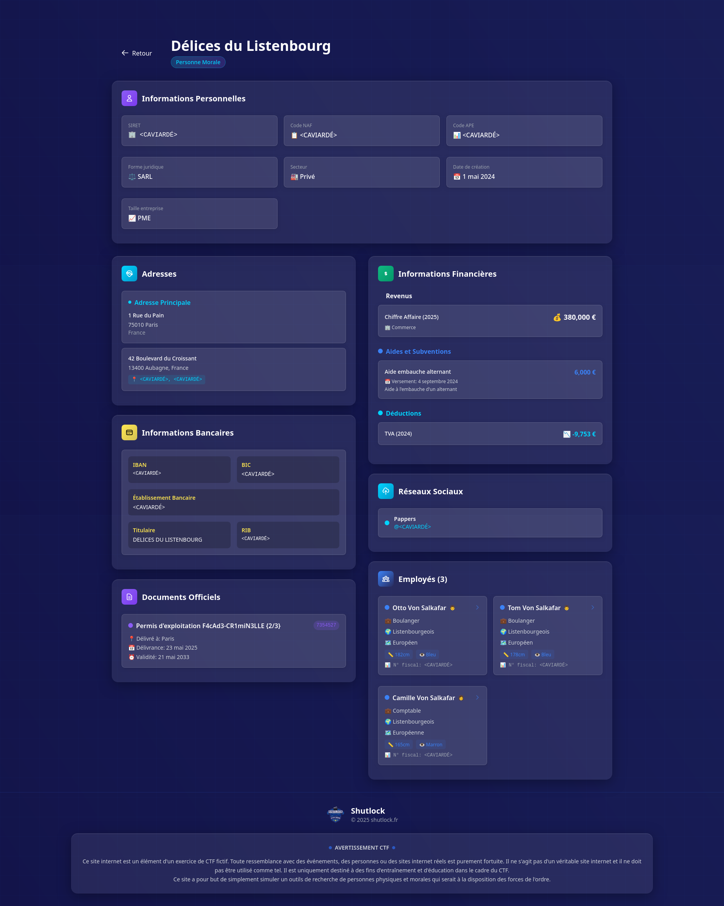

# MiShell forever tonight

<h2>Solution</h2>

Il faut bêtement suivre l'énoncé, soit chercher `Otto Von Salkafar` avec comme token d'accès `N0u5RecRu7oNs`.

Il suffit ensuite d'explorer les différentes pages pour trouver les trois parties du flag.

Il ne s'agit pas vraiment d'un chall, comme le fait remarquer le pied de page : "Ce site a pour but de simplement simuler un outils de recherche de personnes physiques et morales qui serait à la disposition des forces de l'ordre."

Flag : `SHLK{L1n3w4sLyinG_F4cAd3-CR1miN3LLE_sUSP3cT}`

