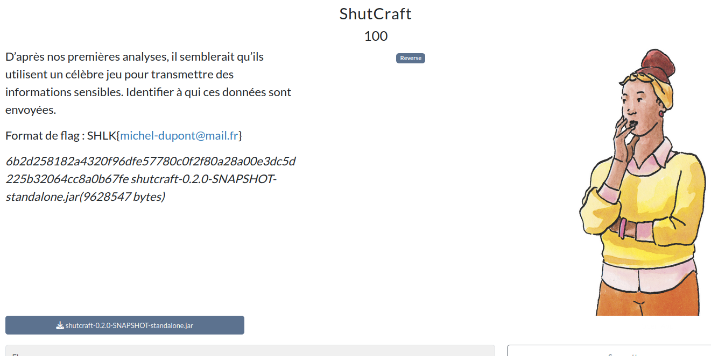

# ShutCraft



## Prérequis

(Optionnel, recommandé) Vérifier les sommes de contrôle.
```bash
sha256sum -c SHA256SUMS.txt
```

<h2>Solution</h2>

<details>
<summary></summary>

* L'énoncé nous indique implicitement qu'il s'agit d'un code en rapport avec Minecraft. Après exploration et quelques recherches, on comprend qu'il s'agit d'un plugin de serveur Minecraft !
* Le flag est une adresse e-mail. On extrait le fichier jar et on cherche donc directement des e-mails :
    ```bash
    grep -rEoh "[a-zA-Z0-9._%+-]+@[a-zA-Z0-9.-]+\.[a-zA-Z]{2,}" . | sort -u | less
    ```
  * On trouve beaucoup d'adresses mais évidemment, les plus crédibles ne fonctionnent pas en tant que flag. Il fallait s'y attendre, c'est un chall de reverse...
* On décompile le plugin :
  * soit avec [JD-Gui](https://java-decompiler.github.io/) et Eclipse, en suivant [ce tutoriel](https://minecraft.fr/forum/threads/comment-d%C3%A9compiler-et-r%C3%A9cup%C3%A9rer-le-code-source-dun-plugin.185143/)
  * soit avec [CFR](https://www.benf.org/other/cfr/) en ligne de commande :
    ```bash
    java -jar cfr.jar ShutCraft.jar --outputdir=shutcraft-src
    ```
* On explore alors le projet, qui contient BEAUCOUP de fichiers. Il va falloir ruser.
* On cherche du code qui contient `send` ou `mail` avec grep :
    ```bash
    cd shutcraft-src
    grep -r "send" . | sort -u
    grep -r "mail" . | sort -u
    ```
* On se tourne alors vers les fichiers `fr/shutlock/shutcraft/mail$xxx.java` qui semblent être des classes de gestion de mail.
* On ne trouve pas d'entrée pour l'adresse de destination. Il faut donc continuer d'explorer le code à la recherche d'un appel à une de ces classes :
    ```bash
    grep -r "fr.shutlock.shutcraft.mail" . | sort -u
    ```
* On tombe sur `fr/shutlock/shutcraft/command$start_game$fn__10158$state_machine__5652__auto____10175$fn__10177.java` avec une utilisation de la classe :
    ```java
    public static final Var const__91 = RT.var("fr.shutlock.shutcraft.mail", "send-mail");
    ```
* On continue de suivre l'appel et on trouve finalement la ligne qui nous intéresse :
    ```java
    inst_10112 = ((IFn)command$start_game$fn__10158$state_machine__5652__auto____10175$fn__10177.const__91.getRawRoot()).invoke(v136, v137);
    ```
* On remonte les variables pour trouver ces deux bouts de code :
    ```java
    targetTranslationKey = Reflector.invokeInstanceMethod(Reflector.invokeInstanceMethod(Reflector.invokeInstanceMethod(Reflector.invokeInstanceMethod(v125, "getBlock", new Object[0]), "getRelative", new Object[]{command$start_game$fn__10158$state_machine__5652__auto____10175$fn__10177.const__21, command$start_game$fn__10158$state_machine__5652__auto____10175$fn__10177.const__85, command$start_game$fn__10158$state_machine__5652__auto____10175$fn__10177.const__21}), "getType", new Object[0]), "getBlockTranslationKey", new Object[0]);
    xor_str = "\r\u0018\u001b\fFX\u0002\u0007C\u0016\u0002\u001e\n\u0007\u0012O\u00112\u0018\u0019\u001aJ8\n\u0016]\u0005\r\u001a\u0015\u000b\u000f\u000e\u0000\u0016\u0019I";
    v126 = targetTranslationKey;
    targetTranslationKey = null;
    v127 = xor_str;
    xor_str = null;
    mail = ((IFn)command$start_game$fn__10158$state_machine__5652__auto____10175$fn__10177.const__86.getRawRoot()).invoke(command$start_game$fn__10158$state_machine__5652__auto____10175$fn__10177.const__87.getRawRoot(), ((IFn)command$start_game$fn__10158$state_machine__5652__auto____10175$fn__10177.const__88.getRawRoot()).invoke(new command$start_game$fn__10158$state_machine__5652__auto____10175$fn__10177$fn__10217(), ((IFn)command$start_game$fn__10158$state_machine__5652__auto____10175$fn__10177.const__89.getRawRoot()).invoke(v126), v127));
    ```
    *quelques lignes qui ne nous intéressent pas sont omises pour la lisibilité*
    ```java
    v136 = mail;
    ```
* On va à la pêche des variables manquantes :
    ```java
    public static final Object const__21 = 0L;
    public static final Object const__85 = -1L;
    public static final Var const__86 = RT.var("clojure.core", "apply");
    public static final Var const__87 = RT.var("clojure.core", "str");
    public static final Var const__88 = RT.var("clojure.core", "map");
    public static final Var const__89 = RT.var("clojure.core", "cycle");
    ```
* Et de la fonction dans `command$start_game$fn__10158$state_machine__5652__auto____10175$fn__10177$fn__10217.java` :
    ```java
    /*
     * Decompiled with CFR 0.152.
     */
    package fr.shutlock.shutcraft;

    import clojure.lang.AFunction;
    import clojure.lang.RT;

    public final class command$start_game$fn__10158$state_machine__5652__auto____10175$fn__10177$fn__10217
    extends AFunction {
        @Override
        public Object invoke(Object char1, Object char2) {
            Object object = char1;
            char1 = null;
            Object object2 = char2;
            char2 = null;
            command$start_game$fn__10158$state_machine__5652__auto____10175$fn__10177$fn__10217 this_ = null;
            return Character.valueOf(RT.charCast((long)RT.intCast(object) ^ (long)RT.intCast(object2)));
        }
    }
    ```
* On a donc tous les éléments pour comprendre la fonction de décodage :
  * `targetTranslationKey` est le nom du bloc Minecraft juste en dessous du joueur
  * `xor_str` est notre e-mail encodé avec un XOR
  * `mail` est l'adresse e-mail décodée, en XORant `targetTranslationKey` et `xor_str`.
* Comme il y a un nombre raisonnable de blocs dans minecraft, on teste par bruteforce, avec une regex pour filtrer les e-mails valides (`solve.py`).
  * On trouve le dataset `en_us.json` [via ce lien](https://mcasset.cloud/1.16.4/assets/minecraft/lang/en_us.json).
* J'ai dans un premier temps trouvé seulement le début du flag... Il faut bien répéter la clé si elle est plus courte que le ciphertext, ce qui est le cas ici !

Flag : `SHLK{otto-von-salkafar@apt-get.listembourg}`

</details>   