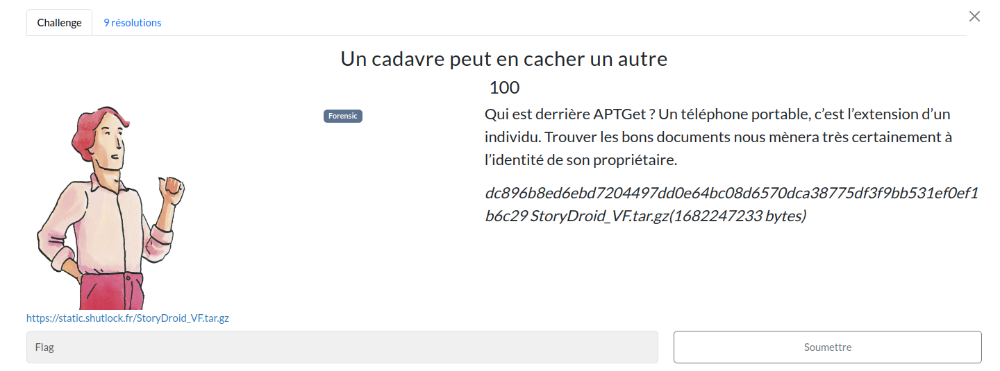
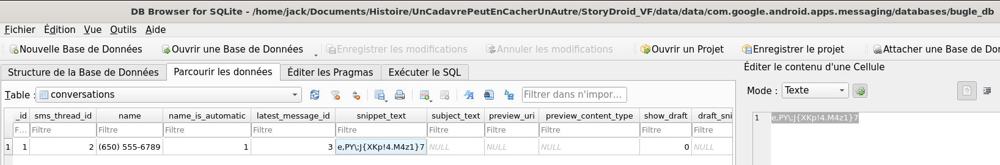
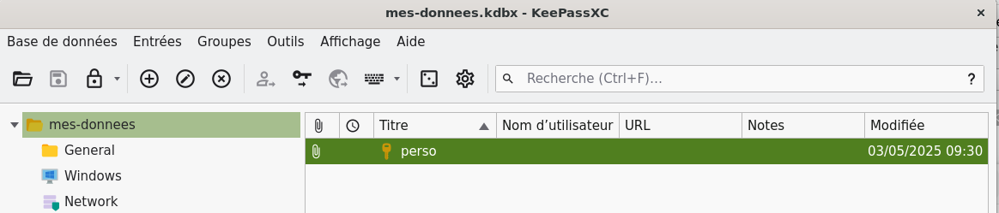
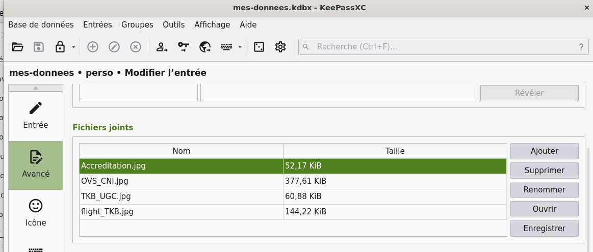
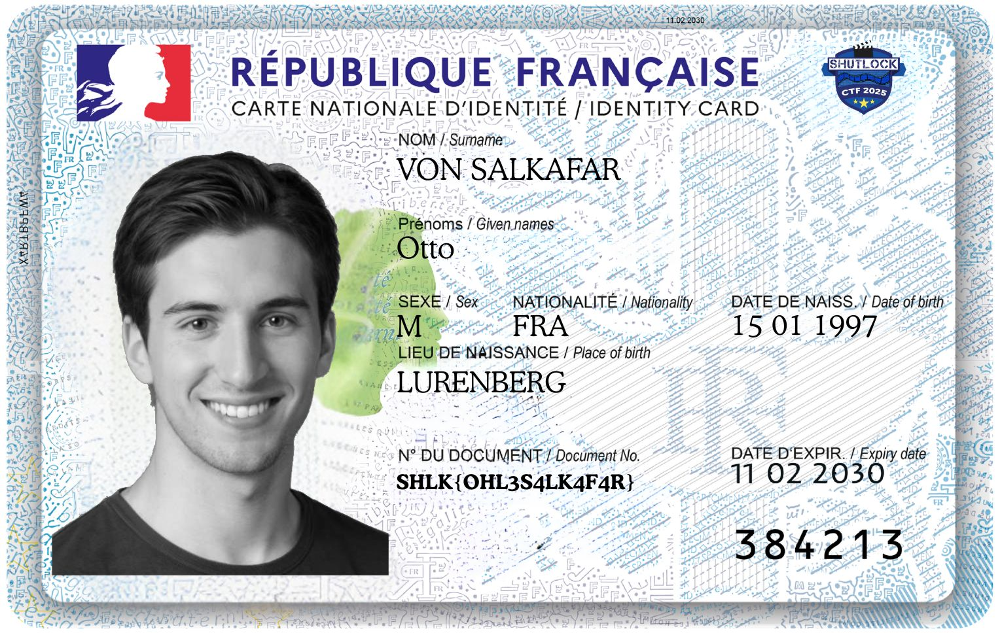

# Un cadavre peut en cacher un autre



## Prérequis

[StoryDroid_VF.tar.gz](https://mega.nz/file/MIZ0HYyb#6HyNiRcFTj_YF8m46hkdBUy0U_5vJG8mRqknEfSIfas)

(Optionnel, recommandé) Vérifier les sommes de contrôle.
```bash
sha256sum -c SHA256SUMS.txt
```

<h2>Solution</h2>

<details>
<summary></summary>


* On a disposition un dump du système de fichiers d'un smartphone Android.
* On explore dans un premier temps `/storage` qui contient les données de l'utilisateur :
  * Les dossiers `0000-0000` et `self` ne contiennent pas de données.
  * Le sous-dossier `emulated/obb` est également vide.
  * En revanche, on trouve des choses dans `/storage/emulated/0` !
* On tombe sur `Download/mes-donnees.kdbx`, une base KeePass ! Il va falloir casser le mot de passe maître...
  * On tente un mot de passe vide, ça ne fonctionne pas.
  * On utilise john avec le [top 20000 de Richelieu](https://github.com/tarraschk/richelieu), mais ça ne fonctionne pas non plus.
  * On tente avec rockyou, on laisse tourner en continuant d'explorer (spoiler : ça n'aurait pas fonctionné non plus, le mot de passe n'y est pas)
* On revient au dossier racine qui contient les dossiers `storage` et `data`
* On tente différents greps avec des mots clés comme `keepass`, `passe`, `mot de passe`, etc. On tombe notamment sur des sous-dossiers de `/data/data/com.google.android.apps.messaging`.
  * La recherche par greps ne donne rien.
* Curieux, je fais des recherches sur `/data/data/com.google.android.apps.messaging`, et j'entreprends d'ouvrir le fichier `databases/bugle_db` avec SQLiteBrowser.
* En explorant la table `conversations`, on trouve une chaîne qui semble aléatoire :
    
* Et si on l'essayait comme mot de passe pour la base KeePass ? Eh bien oui, ça fonctionne ! On peut maintenant accéder au KeePass.
    
* On se jette sur le mot de passe... Qui ne ressemble pas à un flag.
* On remarque que l'entrée contient des fichiers attachés, on les explore.
    
* On trouve le flag dans la photo de CID.
    

Flag : `SHLK{OHL3S4LK4F4R}`

</details>    