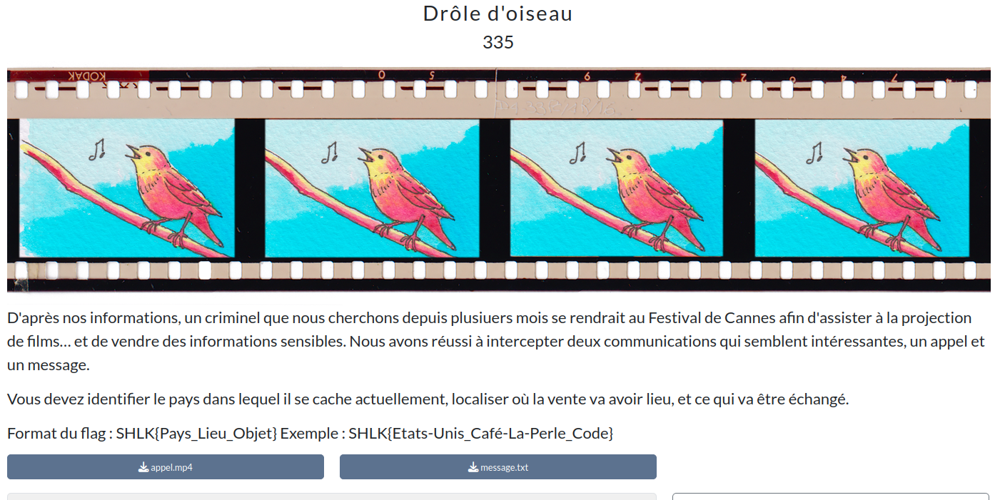

# Drôle d'oiseau



<h2>Solution</h2>

<details>
<summary></summary>

Ce challenge est un mix entre stéganographie et OSINT. La difficulté était surtout de ne pas partir dans tous les sens, et de filtrer les informations inutiles : jour et heure de rencontre, la mention d'un chien, un code étrange pour la date...

On est en présence de deux fichiers : un fichier texte, et... Une vidéo ?? Pour un enregistrement audio, c'est un peu étrange.

Fichier texte
* On commence par le fichier texte. On y trouve un court message... Et beaucoup de "vide".
* On passe le fichier texte dans un outil web pour afficher tous les caractères : [View non-printable unicode characters](https://www.soscisurvey.de/tools/view-chars.php)
* Des espaces et tabulations sont présents à foison. On suppose qu'il s'agit d'un message encodé.
* On commence par tenter des algorithmes de chiffrement, comme on a une sorte de clé (T30-xkc-8M). Rien de concluant.
* Une idée nous vient : et si c'était du morse ? Raté.
* En fait, il s'agissait d'un simple encodage par bits :
  * Pour chaque ligne (visible ou “vide”), on récupère la séquence d'espaces et de tabulations qui se trouve juste avant le retour chariot `CR` `LF`.
  * Les deux à cinq premiers espaces servent seulement à aligner les blocs ; on les supprime. Il reste alors des séquences de 6 à 8 caractères (mélange d’espaces et de tabulations).
  * On adopte la convention : espace ==> 0, tabulation ==> 1.
  * Chaque séquence de 7 bits forme un caractère ASCII (standard “7‑bit US ASCII”).
* On obtient (après réorganisation) le message suivant :
    ```
    Prochain rendez-vous au Lounge Bar pour l'échange des clefs
    ```
* On a donc deux éléments du flag, reste le pays.

Vidéo
* On vérifie les métadonnées, rien de concluant.
* La vidéo semble être un fond blanc constant, pour écarter l'hypothèse d'une image cachée, on extrait l'ensemble des frames : rien.
* Après écoute de la vidéo, on entend un oiseau derrière la voix. Ni une, ni deux, on passe la vidéo dans un outil de reconnaissance d'oiseaux : [BirdNet](https://birdnet.cornell.edu/) (oui oui, pas besoin d'extraire l'audio ni même le découper !)
  * Qui nous donne les possibilités suivantes (par ordre de probabilité) :
    ```
    Psittacula eques
    Sialia Currucoides
    Melanerpes formicivorus
    ...
    ```
* Ce qui nous donne, après des recherches sur Wikipédia, pour les premiers oiseaux :
  * Maurice
  * Etats-Unis
  * Colombie
* C'était bien l'île Maurice. On flag.

Flag : `SHLK{Maurice_Lounge-Bar_Clefs}`

</details>