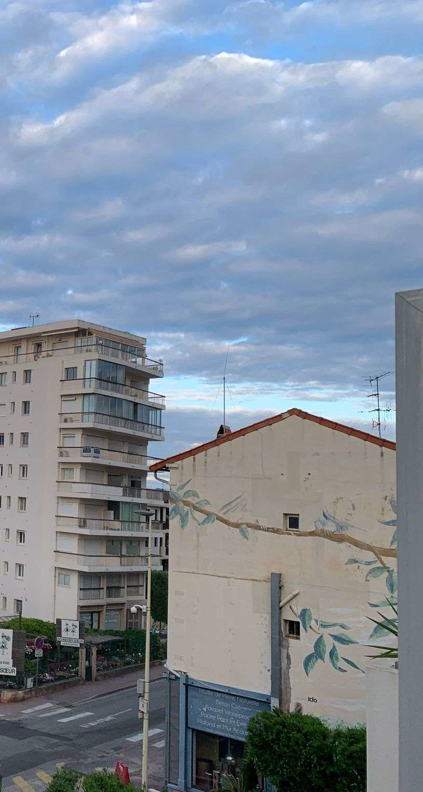
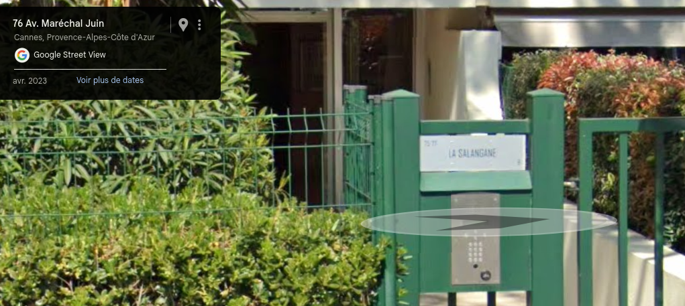

# Find The Lab

## Énoncé

> En fouillant le site WEB de ForaCorp,  nos experts ont trouvé cette image assez intriguante. Elle était  accompagnée de cette phrase : "On se retrouve ici, comme d'habitude, on  se voit bientôt pour le festival !".
>  
> À vous de retrouver où cette photo a été prise. Nous nous devons  d'être le plus précis possible. Nous cherchons le nom de la résidence et l'étage depuis lequel la photo a été prise.
> 
> Format de flag : SHLK{nomresidence_etage}
> 
> 3101b006a88d1b3a76cc215f69ea836cdba69dc5f5e6c7f90769bea892b29db9  lab.jpg (282329 bytes)

<h2>Solution</h2>

### Analyse de l'énoncé

> En fouillant le site WEB de ForaCorp,  nos experts ont trouvé cette image assez intriguante. Elle était  accompagnée de cette phrase : "**On se retrouve ici, comme d'habitude, on  se voit bientôt pour le festival !**".
>  
> À vous de retrouver où cette photo a été prise. Nous nous devons  d'être le plus précis possible. Nous cherchons le **nom de la résidence** et l'**étage** depuis lequel la photo a été prise.

### Pistes

* Pas de données EXIF.
* On note plusieurs éléments :
   * Une oeuvre de street art (des branches/feuilles) sur le bâtiment avant droit, signée “ido” ou “icio”.
   * Un artisan qui fait béton ciré, parquet waterproof et papier peint, même bâtiment
   * Une enseigne “??? SOEUR” avec un logo de deux jeunes filles

### Flag

* Un coup dans google image, recherche par image : 
   * Street art : pas de match
   * Artisan : pas de match
   * Enseigne des soeurs : MATCH !
     * https://jardinerieschneidersoeur.com/
* L'adresse de l'enseigne :
  * **2 Rue de Russie, 06400 Cannes**
* On a la vue de la photo autour de l'adresse suivante :
  * **76 Av. Maréchal Juin Cannes, Provence-Alpes-Côte d'Azur**
* Selon l'angle de prise de vue, on en déduit que la photo a été prise du bâtiment juste devant l'entreprise “Mur Sol Plafond”
* Celui-ci semble être une résidence. Elle n'est pas référencée sur Google Maps, cependant on trouve un panneau “**La Salangane**”
  * 
* Une recherche sur Google nous donne :
  * https://lasalangane.hotelcannes.info/
* Étant donnée la prise de vue, on table sur au moins le 2e étage
   * Raté, c'est le 3e !
* Après quelques tentatives, on trouve donc le flag.
  * `SHLK{salangane_3}`

