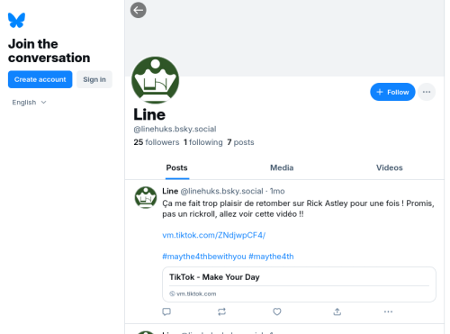
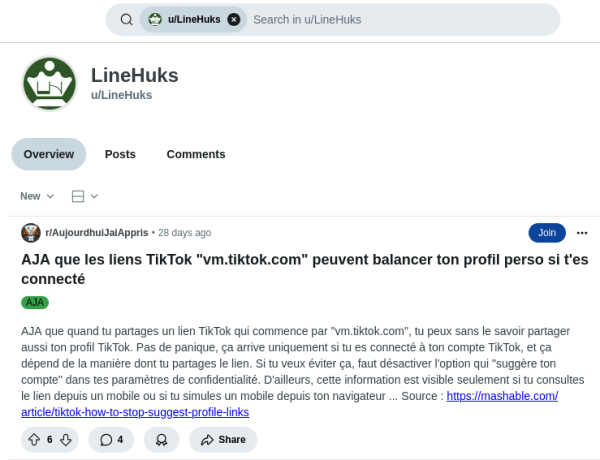
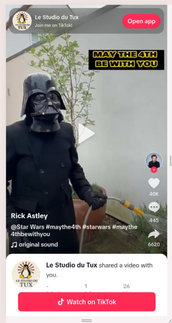
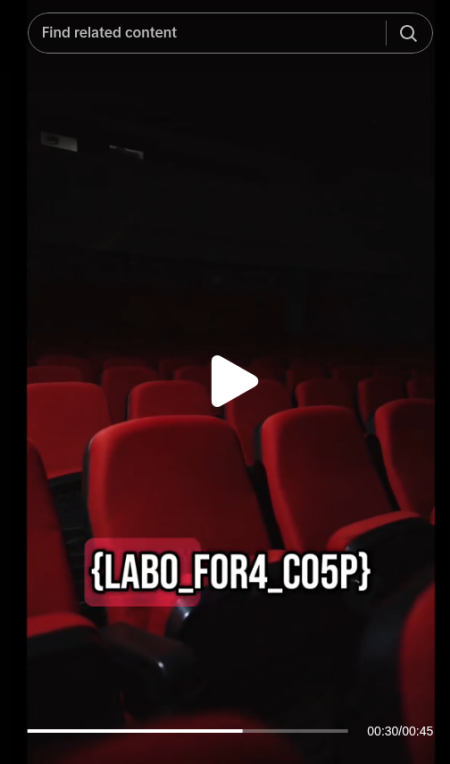

# Un pingouin dans une botte de foin

## Énoncé

> Nous avons interrogé à l’instant Line Huks, réalisatrice du documentaire « L’s Dead ». Elle nous a confié ne pas avoir souhaité assister à la projection en raison d’un stress intense.
> 
> Elle a également précisé que le Digital Cinema Package (DCP), le format livré pour la projection, avait été préparé par un laboratoire externe. Ainsi, entre l’export final du film et sa diffusion au festival, de nombreuses personnes auraient potentiellement eu accès au contenu.
> 
> Nous vous demandons d’enquêter sur Line Huks et d’en apprendre davantage sur elle. Par ailleurs, nous avons omis de lui demander le nom du laboratoire qui a réalisé le DCP…

<h2>Solution</h2>

### Analyse de l'énoncé

> Nous avons interrogé à l’instant **Line Huks**, réalisatrice du documentaire « **L’s Dead** ». Elle nous a confié ne pas avoir souhaité assister à la projection en raison d’un stress intense.
> 
> Elle a également précisé que le Digital Cinema Package (DCP), le format livré pour la projection, avait été préparé par un **laboratoire externe**. Ainsi, entre l’export final du film et sa diffusion au festival, de nombreuses personnes auraient potentiellement eu accès au contenu.

### Pistes

* On cherche sur LinkedIn : rien de promettant.
* Oh, un compte X. Qui follow le compte “Festival de Cannes”. Ca semble être une bonne piste. La date de création (avril 2025) est également cohérente.
   * 
   * https://x.com/LineHuks/
* Ce compte X est vide, mais redirige vers un compte BlueSky.
   * 
   * https://bsky.app/profile/linehuks.bsky.social
* Quelques postes, un sur un film ⇒ on passe l'image de film à Aperisolve (passe outguess, steghide et d'autres outils, depuis le navigateur), rien...
   * Oui, je suis déjà parti en sucette 😂️
* Le post le plus récent poste partage un post TikTok :
   * https://vm.tiktok.com/ZNdjwpCF4/
* On remarque que le nom d'utilisateur est commun aux comptes bluesky  et X : **linehuks**
* Un coup de recherche avec SocialScan (par exemple), on trouve un autre compte :
   * Reddit : https://www.reddit.com/user/LineHuks/

### Flag

* D'après un post reddit sur le compte de Line, on peut voir quel utilisateur nous a envoyé une vidéo sur mobile.
  * 
* Il faut donc ouvrir le lien TikTok trouvé en vue mobile. On tombe alors sur le compte du studio de Line :
  * 
  * https://www.tiktok.com/@lestudiodutux
  * La première vidéo nous indique que nous sommes sur la bonne voie (référence au film)
* Le flag se trouve dans une vidéo du compte TikTok
  * 
  * https://www.tiktok.com/@lestudiodutux/video/7500242847291968790

`SHLK{LABO_FOR4_CO5P}`

