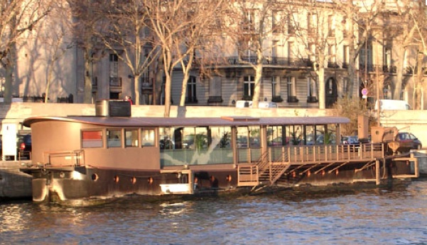
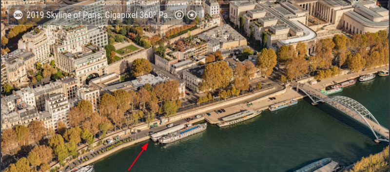
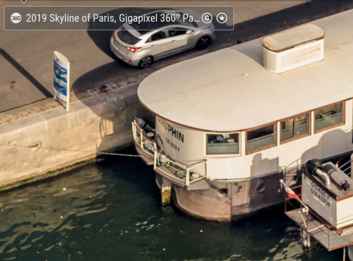
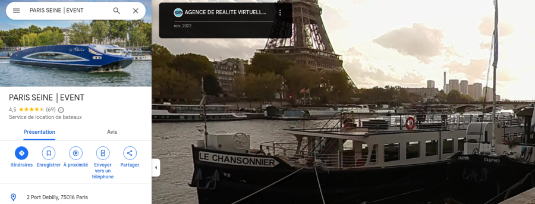
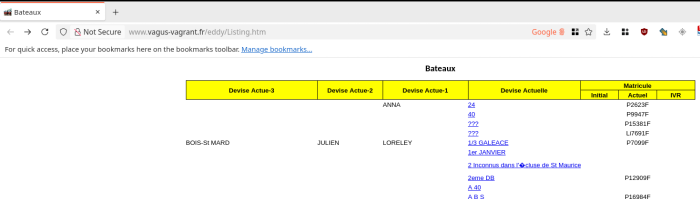
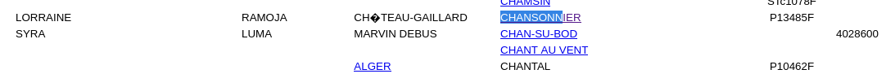
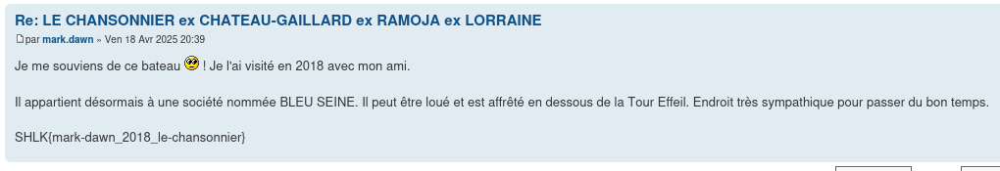

# Une simple conversation

## Énoncé

> On a réussi à intercepter un appel du numéro sur écoute. Il faut l’analyser au plus vite.
> 
> Nous devons absolument identifier la personne qui a appelé. Un lieu et une date ont également été mentionnés durant la conversation. Il faudra retrouver toutes ces informations.
> 
> b3df10f96fe989a9c06c79aa1cc58141c22126f042c8c81a64eea567569a5d32  enregistrement_appel_APTGet.mp3 (839622 bytes)

<h2>Solution</h2>

### Analyse de l'énoncé

> Nous devons absolument **identifier la personne qui a appelé**. Un **lieu** et une **date** ont également été mentionnés durant la conversation. Il faudra retrouver toutes ces informations.

#### Enregistrement audio

*Converti avec [ce site](https://converter.app/audio-to-text/result.php) puis ajusté*

> "Allo ? C'est Marc. Pourquoi tu me réponds pas ? Il y a un truc de pas normal là.
> 
> J'ai le pressentiment qu'il va se passer quelque chose.
> 
> [bruit de fond : on entend ce qui semble être un train ou metro freiner, et annonce d'un arrêt "Concorde"]
> 
> Tout va trop vite en ce moment. Et tout m'indique qu'on a fait quelque chose de mal à un endroit.
> 
> [bruit de fond : annonce d'un arrêt "Concorde", seconde annonce, ton descendant]
> 
> Tu me connais, tu sais que je panique pas habituellement. Mais là, il faut vraiment, vraiment qu'on se parle.
> 
> [bruit de fond : “Attention à la marche en descendant du train/tram (masqué par la voix)”]
> 
> Il faut qu'on se voit très rapidement.
> 
> Écoute, là je suis à l'endroit où tout a commencé. Là où on s'est rencontré pour la première fois.
> 
> Tu te souviens de Jeffrey “M" ? Celui qui venait de la ville où les bâtiments ont deux numéros ? Enfin, peu importe.
> 
> Notre bateau a encore son liseret et il est toujours à côté du dauphin.
> 
> Je t'attends. Si tu mets trop de temps à venir, je devrais partir sans toi."

### Pistes

* L'appelant se présente comme Marc
* Un élément nous saute non pas aux yeux mais aux oreilles : l'arrêt annoncé, et les bruits ambiants qui font clairement penser au métro de Paris (bruit de fermeture des portes).
   * Il y a bien une station Concorde à Paris : https://www.metroparis.paris/metro-concorde.php, https://www.bonjour-ratp.fr/stations-metro/concorde/
   * D'après ChatGPT (et d'autres LLM), Paris est la seule piste : “La seule ville en France avec un arrêt nommé "Concorde" dans un réseau de transport ferroviaire et un son de fermeture des portes identique au métro parisien est : Paris."
   * Cela semble être le cas, en cherchant on ne trouve pas d'autres stations avec ce nom ailleurs en France.
* "la ville où les bâtiments ont deux numéros" : une ville sort du lot, Prague
   * https://www.avantgarde-prague.fr/sorienter-a-prague/
* Autre pivot potentiel : chercher les “Jeffrey M”
   * Aime
   * Hem / Emme
   * Me
   * Noms en M les + courants
      * Martin — très courant, souvent abrégé en “M.” dans le langage courant
      * ...
* On trouve un Jeffrey Martin très connu à Prague... Merci le hint du créateur du chall
   * https://www.jeffrey-martin.com/
   * Il est connu pour ses panoramas, des prises de vue avec beaucoup de détails sur 360°, en fusionnant des images très grandes
   * Il en a notamment fait un depuis la tour Eiffel, à Paris : https://www.jeffrey-martin.com/paris
* Quid du Dauphin ? Après une recherche “dauphin port concorde Paris", on tombe sur ce site :
   * https://www.peniches-evenementielles.com/portfolio/dauphin/
* Eh oui, c'est un bateau !
  * 
* En cherchant l'adresse sur maps et en cherchant dans la vue de Jeffrey, on trouve notre dauphin :
  * 
  * 
* Le bateau a côté a bel et bien un liseret. Il appartient à la même entreprise : https://bleuseine.com/
* C'est “Le Chansonnier”
  * 
* Reste à trouver le lieu et l'heure...

### Flag

* On tente un “google dorks” :
   * `"bateau" le "chansonnier" marc`
* On tombe sur un forum intriguant :
  * 
  * http://www.vagus-vagrant.fr/eddy/Listing.htm
* Il référence bien un “chansonnier” :
  * 
* Par curiosité, on clique. Les photos dans le topic semblent correspondre au bateau. Et... Oh, sur le dernier post...
  * 

`SHLK{mark-dawn_2018_le-chansonnier}`

