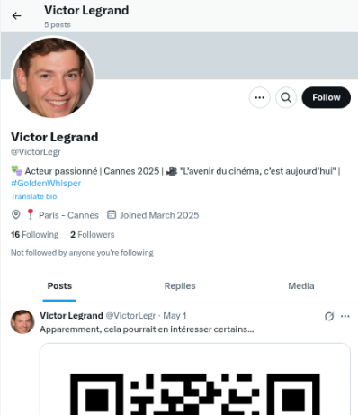
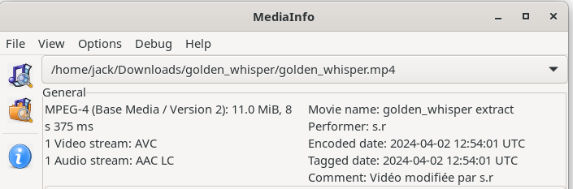
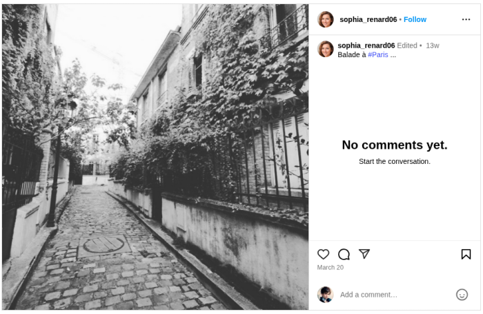
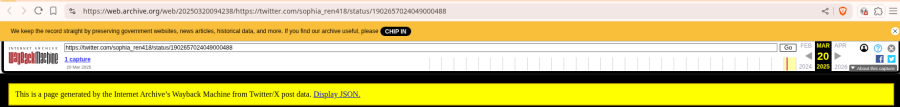
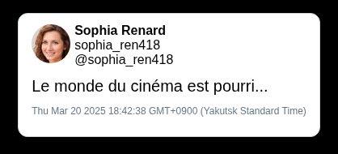
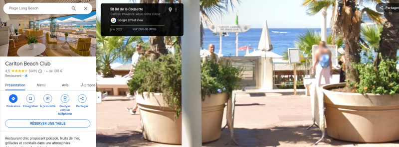
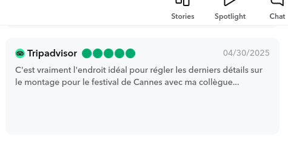
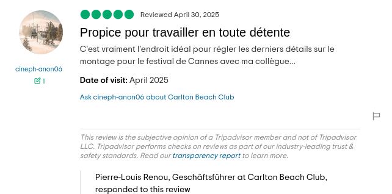
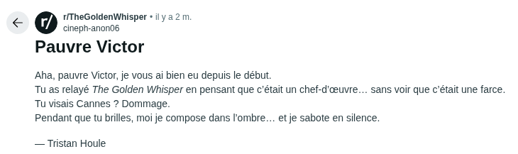

# Whispers of Envy 1/2

## Énoncé

> Victor Legrand, candidat à la DGSI, est  accusé par un compte sur X, d'avoir fait fuiter un film très attendu au Festival de Cannes 2025.
> 
> Vérifiez ces déclarations et démasquez l'auteur  de la fuite.
>
> Flag attendu : SHLK{prenom_nom}

<h2>Solution</h2>

### Analyse de l'énoncé

> **Victor Legrand**, candidat à la DGSI, est  accusé par un compte sur X, d'avoir **fait fuiter un film** très attendu au **Festival de Cannes** 2025.

### Pistes

* En cherchant Victor Legrand sur X, on tombe sur ce compte : https://x.com/VictorLegr
* Il a publié un QrCode :
  * 
   * Décodé : https://mega.nz/file/napW2YzL#tZEs_M9ltnSsBX55rKZ6JsOEKQhkLXo6LtSMEHLdHWI
* La vidéo en elle-même ne contient rien de concluant. Par contre, il y a un commentaire dans les métadonnées :
  * 
  * `Artist : s.r`
  * `Comment : Vidéo modifiée par s.r`
* En explorant les followers de Victor, on tombe sur une certaine Sophia Renard : https://x.com/sophia_ren418
   * Eh non, ce n'est pas le flag...
* Par contre, cette dame à un compte Instagram : https://www.instagram.com/sophia_renard06/
  * Elle réside visiblement à Paris ou s'y rend occasionnellement : **Square des peupliers, Paris XIII ème**
  * 
      * https://escaledenuit.com/les-plus-belles-rues-de-paris-et-les-plus-insolites/
   * Mention d'un "confrère" et d'une action pour le cinéma libre.
   * Puis, impasse...
* Et si on regardait sur WaybackTweet ?
   * Un tweet supprimé... Mais pas plus d'informations.
   * 
   * https://web.archive.org/web/20250320094238/https://twitter.com/sophia_ren418/status/1902657024049000488	
  * 
* On retrouve également le lieu de ce post Instagram : **Carlton Beach Club** ([Google Maps](https://maps.app.goo.gl/QZAAi9hWi6zHCKRJ8))
	

### Flag

* En cherchant Carlton Beach Club sur Snapchat, on tombe sur un avis (externe) fort intéressant, qui colle avec la date du post instagram :
  * 
  * https://www.snapchat.com/place/carlton-beach-club/7cd29524-5754-11ea-aa56-ff54d7a4d744
* En allant sur Tripadvisor, on retrouve le pseudo de la personne qui a posté l'avis : cineph-anon6
  * 
  * https://www.tripadvisor.com/ShowUserReviews-g187221-d21130048-r1005247869-Carlton_Beach_Club-Cannes_French_Riviera_Cote_d_Azur_Provence_Alpes_Cote_d_Azu.html
* Un coup de google et miracle, on tombe sur un subreddit au nom très familier...
  * 
  * https://www.reddit.com/r/TheGoldenWhisper/comments/1kmh2p8/pauvre_victor/

`SHLK{tristan_houle}`

