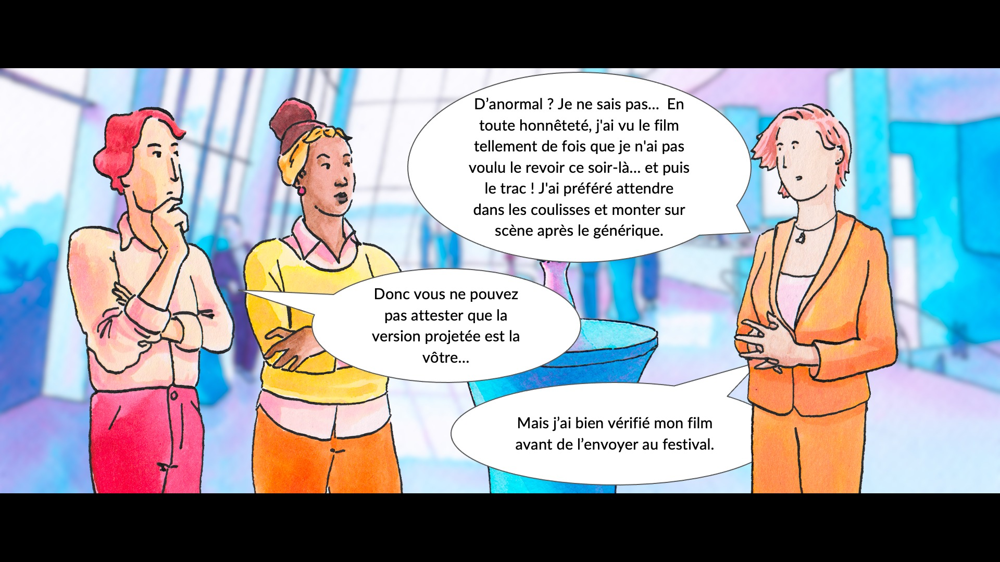
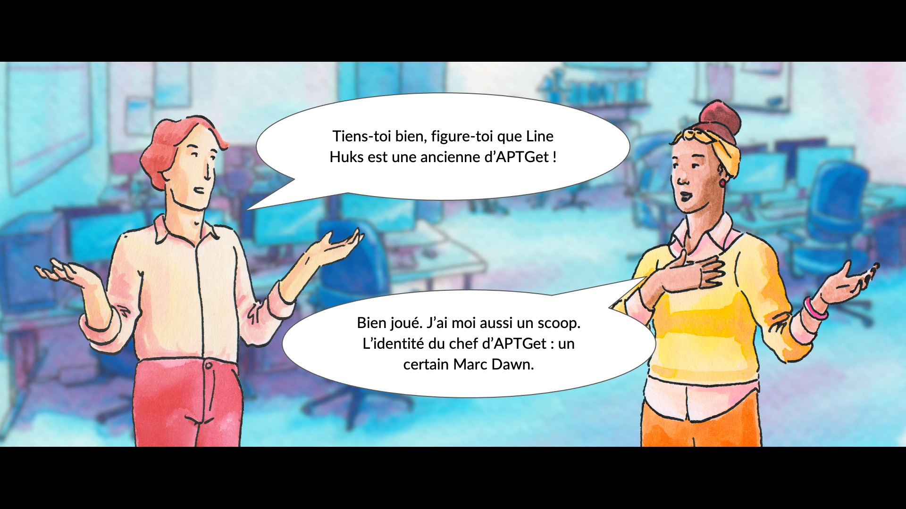

# Shutlock CTF 2025 - Write Ups

    

Mes writeups pour le Shutlock CTF édition 2025 en tant que participant.

> [!TIP]
> For the English speaking community, this is a writeup of the Shutlock CTF 2025, a French cybersecurity competition. The content is primarily in French, but my code and comments are in English.

## L'événement

20/06/2025 20h - 30/06/2025 20h

https://shutlock.fr/

Vous êtes plutôt Forensic, Reverse, Pwn, OSINT, Crypto, Web et autres ? Dans quel domaine de la sécurité informatique excellez-vous?

Que vous soyez novice, expert ou simplement passionné d'informatique et désireux de découvrir les métiers techniques de la Direction Générale de la Sécurité Intérieure (DGSI), participez à la deuxième édition du CTF. Repoussez vos limites et révélez votre talent ! Les meilleurs compétiteurs se verront récompensés.

SHUTLOCK est le fruit d'une très étroite collaboration et d'une belle aventure humaine entre les alternants de l'EPITA et les experts de la DGSI. Nous espérons que vous prendrez autant de plaisir à résoudre ces challenges que nous en avons eu à les co-créer.

## Code couleur

⚪️ Introduction 
🟢 Facile 
🔵 Moyen 
🔴 Difficile 
⚫️ Diabolique 

## Histoire

Introduction

⚪️ OSINT - [Un pingouin dans une botte de foin](OSINT/)
 ou 
⚪️ Forensic - Le Générique de Trop (non résolu)

Checkpoint 1

🟢 Web - RealBe (non résolu)
 ou 
🟢 Crypto - [As cool as xor](Histoire/AsCoolAsXor/)

Checkpoint 2

🟢 OSINT - [Find the Lab](OSINT/)
 ou 
🟢 Misc - Une affiche étrange (non résolu)

Perquisition

🟢 Forensic - [Un cadavre peut en cacher un autre](Histoire/UnCadavrePeutEnCacherUnAutre/)
 ou 
🟢 Reverse - [ShutCraft](Histoire/ShutCraft/)

Checkpoint 4

🟢 Crypto - [Factor Me if You Can](Histoire/FactorMeIfYouCan/)
 ou 
🔴 PWN - Messager (non résolu)

Checkpoint 5

🔵 Misc - A mission for Charles Carmichael (non résolu)
 ou 
🔵 OSINT - [Une simple conversation ](OSINT/)

Checkpoint 6

🔵 Misc - [MiShell forever tonight](Histoire/MiShell/)

Conclusion

## Challenges

### OSINT

[Page dédiée](OSINT/) (j'ai travaillé avec CherryTree)

### Reverse

🟢 [Basic Shellcode](Reverse/BasicShellcode/) 
🟢 [Véritable Mystère](Reverse/VeritableMystere/) 
🟢 [EnterWasm](Reverse/EnterWasm/)

### Forensics

🟢 [APT Downgrade Part 1](Forensics/APTDowngrade/) 
🔵 [SpyDroid](Forensics/SpyDroid/)

### Crypto

🟢 [Lifting Weights](Crypto/LiftingWeights/) 
🔵 [Lifting Heavier Weights](Crypto/LiftingHeavierWeights/)

### Web

*Je n'ai pas effectué de challenge dans cette catégorie*

### Misc

🟢 [Drôle d'oiseau](Misc/DroleDoiseau/)

### PWN

*Je n'ai pas effectué de challenge dans cette catégorie*

## Scoreboard

J'ai terminé 25e avec un total de 2 696 points. Grand progrès pour mon second gros CTF 🥳

Fichier json de CTFd pour le scoreboard : [scoreboard.json](scoreboard/scoreboard.json)

Image (longue)

