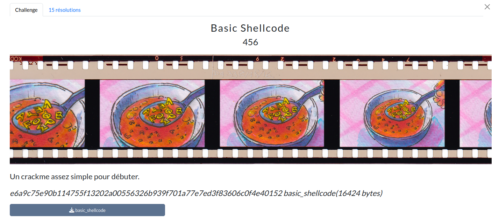

# Basic Shellcode



## Prérequis

(Optionnel, recommandé) Vérifier les sommes de contrôle.
```bash
sha256sum -c SHA256SUMS.txt
```

<h2>Solution</h2>

<details>
<summary></summary>

* On est face à un programme qui demande un mot de passe, qui est notre flag.
* On l'ouvre dans IDA, on explore.
* On décompile le programme principale avec F5, et on traduit le pseudo-code avec ChatGPT pour le rendre plus lisible.
* On comprend qu'il contient une partie qui est un shellcode.
* On crée un programme Python pour extraire le shellcode, on obtient alors un binaire `shellcode.bin`.
* On le décompile avec `objdump` :
    ```bash
    objdump -D -b binary -m i386:x86-64 shellcode.bin > shellcode_desass.asm
    ```
* On demande ensuite à Perplexity de nous aider à réécrire l'ensemble du code. Pour cela, on décompile en plus la fonction check qui est la fonction clé de vérification du flag. On peut dès lors écrire un programme pour inverser le flag. On le compile, on le lance.
* On vérifie le flag en exécutant le challenge avec le flag trouvé, bingo !

Flag : `SHLK{Th3NexT_0nEwoNtBe-s0SimPle}`

</details>