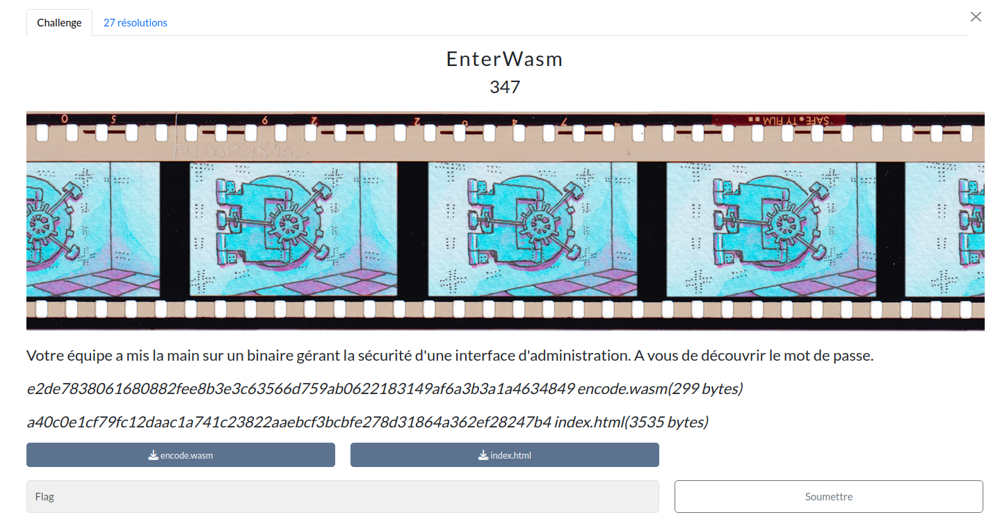

# EnterWasm



## Prérequis

(Optionnel, recommandé) Vérifier les sommes de contrôle.
```bash
sha256sum -c SHA256SUMS.txt
```

<h2>Solution</h2>

<details>
<summary></summary>

* On est face à une interface Web, qui utilise du code WebAssembly pour vérifier le mot de passe.
* On entreprend de "convertir" ce code en C. On essai d'abord avec `wasm2c`, mais le code produit est bien trop long et bien trop complexe.
* On décompile donc le code WebAssembly avec `wasm2wat` de [WebAssembly Binary Toolkit](https://github.com/WebAssembly/wabt/tree/main) :
    ```bash
    wasm2wat encode.wasm -o encode.wat
    ```
* Après des heures de bataille avec ChatGPT, Gemini et Perplexity, on réussit enfin à obtenir un programme C équivalent.
  * Le premier code fonctionnel est `solve/debug/encode-debug.c`, on l'obtient en comparant les états de registres avec les DevTools du navigateur et les variables du programme C.
  * On le simplifie : `solve/debug/encode-simplified-debug.c`, ça fonctionne encore, ouf.
  * Et enfin, on obtient le code final : `encode.c` (retrait des printf de debug)
* On vérifie l'équivalence ainsi :
  * On passe "password" dans la fonction check, et on récupère l'état du buffer après l'exécution.
  * On modifie la valeur de "data2" dans le wat par cet état du buffer.
  * On recompile en wasm avec `wat2wasm` et on vérifie que le mot de passe est accepté par le navigateur. C'est le cas, bingo !
* Puis commence le plus compliqué : inverser les opérations de check.
  * Que ce soit moi ou les différents LLM, on n'arrive pas à inverser les opérations de check.
  * J'ai même réimplémenté le programme en Python, et vérifié l'équivalence via une utilisation du wasm depuis Python.
* Je décide de faire du bruteforce.
* Oublions le brute-force en Python, on en a pour **75 812** jours...
* Quid du C ? Et si on utilisait un GPU ?
* On demande à Perplexity de nous créer un programme de bruteforce... En cuda !
* Après un premier essai, on teste dans un premier temps avec password... Et ça ne fonctionne pas.
  * On remarque tout de même le temps d'exécution "raisonnable".
* Après debug, il s'avère que l'implémentation de check en cuda n'était pas correcte.
  * On teste un patch avec `debug/test-cuda.cu`, et ça fonctionne !
* Après un peu plus de debug, on a un programme de bruteforce fonctionnel : `bruteforce.cu`.
  * On commence par tester avec le charset `pasword`, et ça fonctionne.
* On étend à `abcdefghijklmnopqrstuvwxyzABCDEFGHIJKLMNOPQRSTUVWXYZ0123456789_-`, on remplace la variable data_2 et on va se coucher.
* Le lendemain matin, on a le flag !
    ```
    [i] Total number of combinations : 281474976710656 combinaisons
    [i] Starting bruteforce...

    [!][i] Password(s) found :
    -> pureWASM
    [i] Bruteforce completed in 18856.01 seconds.
    ```
    *18856 secondes = 5 heures 14 minutes 16 secondes*

Flag : `SHLK{pureWASM}`

</details>