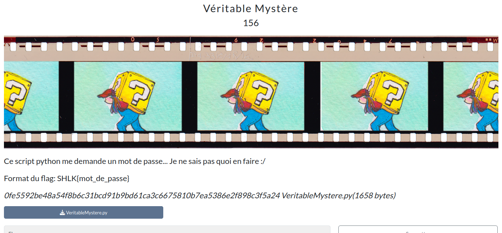

# Basic Shellcode



## Prérequis

(Optionnel, recommandé) Vérifier les sommes de contrôle.
```bash
sha256sum -c SHA256SUMS.txt
```

<h2>Solution</h2>

<details>
<summary></summary>

* On a un programme Python obfusqué (charge un base64, décompresse puis exécute le résultat).
* On commence par déobfusquer le code Python avec [Cyberchef](https://cyberchef.io/) : décodage base64, puis décompression bz2.
* On obtiens un code peu compréhensible : `deobf_VeritableMystere.py`.
* On le passe à ChatGPT qui renomme les variables et fonctions pour nous aider à comprendre le code.
* C'est une mini-machine virtuelle qui exécute des instructions à partir d'un shellcode ! (`HR_VeritableMystere.py`)
* Pour une meilleure lisibilité (et éviter des redondances), on met le shellcode dans `shellcode.py`.
* On crée un programme qui désassemble le shellcode selon les instructions de la machine virtuelle (`disass.py`).
* On comprend que le shellcode XOR le mot de passe entré avec des constantes, puis compare bit à bit chaque octet avec le résultat attendu.
* On crée un programme de solve qui :
  * Récupère chaque valeur des constantes de XOR et chaque octet du résultat attendu (à partir du programme désassemblé) ;
  * Reconstruit le mot de passe de base.
* Il faut bien observer le fonctionnement du shellcode :
  * Les valeurs sont mises sur une pile, donc la comparaison est faite en partant de la fin ! (droite à gauche)
  * Les bits étant décalés vers la droite, les bits dans chaque octet sont également à l'envers, en lisant les instructions du shellcode de haut en bas.
* Il faut donc faire une double inversion (bits dans les octets, octets)

Flag : `SHLK{cE5TUNVRa!My$7eRe3NPY7h0nEnPlUs!}`

</details>